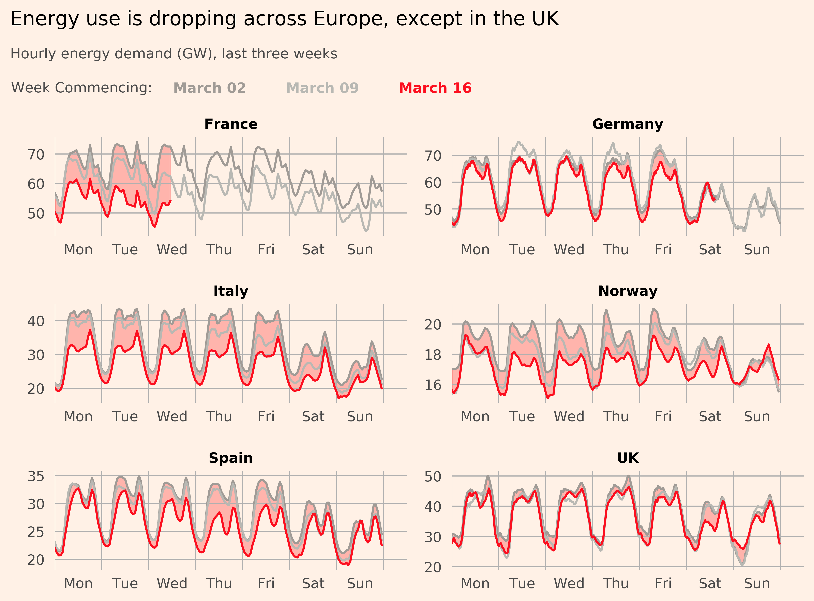

# Europe Energy Corona Drop-Off

 

I recently spotted a <a href="https://twitter.com/jburnmurdoch/status/1241731224906936321?s=20">tweet</a> by John Burn-Murdoch showing how the energy consumption in different countries had declined due to the coronavirus. The FT <a href="https://www.r-bloggers.com/the-financial-times-and-bbc-use-r-for-publication-graphics/">use R</a> for their visualisations but its possible to do them in Python as well which is what we'll set out to do today.

Original visualisation:

</img>
 
 

Reworked & updated version:

</img>
 
